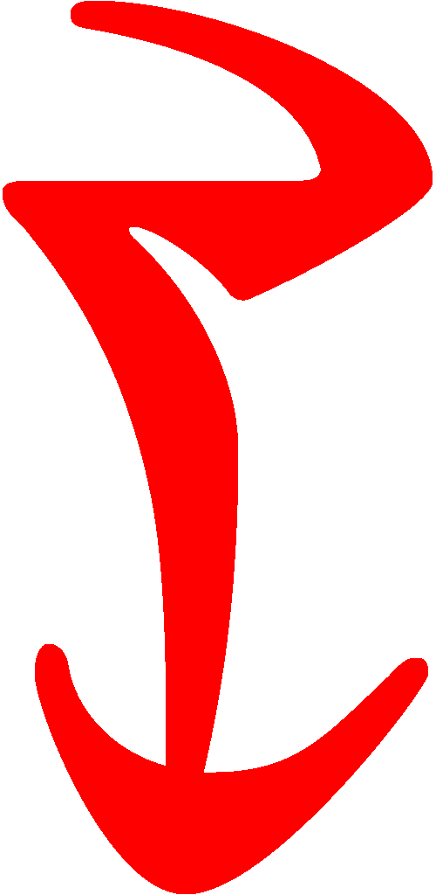

---

<!--- CSS for local font files -->

<!--- Jekyll Page Links -->

<a href="../../../index.html">Home</a>
&emsp;&nabla;&emsp;
<a href="../../index-study.html">Study Format</a>
&emsp;&nabla;&emsp;
<a href="../../index-traditional.html">Traditional Format</a>
&emsp;&nabla;&emsp;
<a href="../../index-ashlands.html">Ashlands Edition</a>
&emsp;&nabla;&emsp;
<a href="../../../about.html">About</a>

<!--- Markdown Body Below: -->

---

## Ascahna'Shoreshik

#### Sermon Twenty

he first monster was actually two, having been born twice like his mother-father, Vivec.
<b>&sup2;</b>He was not the mightiest of the eight to escape Muatra, but his actions were the most worrisome.
<b>&sup3;</b>He was known as Moon Axle, and he harvested the leftover foibles of nature.
<b>&#8308;</b>This he did twice, as was said, and the second harvest always brought ruin or unwritten law.
<b>&#8309;</b>His aspect was faceted like a polyhedron.

<b>&#8310;</b>No perils are mentioned in the finding of Moon Axle, but it was known that he was immune to spears, so Vivec had to use the sword not held against him.
<b>&#8311;</b>Before he took issue with the monster, the warrior-poet asked:

'How came you to be immune to spears?'

<b>&#8312;</b>To which Moon Axle replied, 'Mine is a dual nature, and protean. I am in fact made of many straight lines, though none last too long. In this way I have learned to ignore all true segments.'

<b>&#8313;</b>Luckily, the sword not held was curved and therefore could cut into Moon Axle, and before the sun was up he was bleeding from many wounds.
<b>&sup1;&#8304;</b>Vivec did not slay him outright for to do so would keep the foibles of nature within him and not back where they belonged.
<b>&sup1;&sup1;</b>Soon Vivec had traced geography right again, and Moon Axle was ready to be slain.

<b>&sup1;&sup2;</b>Vivec rose up in his giant-form, to be terrible to look upon.
<b>&sup1;&sup3;</b>He reached into the west and pulled out a canyon, holding it like a horn. He reached east and ate a handful of nix hounds.
<b>&sup1;&#8308;</b>Blowing their spirits through the canyon made a terrible wail, not unlike an unsolved woman.
<b>&sup1;&#8309;</b>He said:

'Let this overtake you,' and Moon Axle was overtaken by the curvatures of stolen souls.
<b>&sup1;&#8310;</b>They wrapped about the monster like resin, until finally he could not move, nor could his dual nature.

<b>&sup1;&#8311;</b>Vivec said, 'Now you are solved,' and pierced his child with Muatra.
<b>&sup1;&#8312;</b>Moon Axle had been reduced to something static, and therefore shattered.

<b>&sup1;&#8313;</b>The lines of Moon Axle were collected by Velothi philosophers and taken into caves.
<b>&sup2;&#8304;</b>There, and for a year, Vivec taught the philosophers how to turn the lines of his son into the spokes of mystery wheels.
<b>&sup2;&sup1;</b>This was the birth of the first Whirling School. Before, there had only been the surface thought of fire.

<b>&sup2;&sup2;</b>Vivec looked at his first wheeling students and observed:

'Alike the egg-layered universe is this morbid possession of three-distant coverage, soul-wrecked and alive, like my name is alive.
<b>&sup2;&sup3;</b>In this cloister you have discovered one walking path, hilled like a sword but more coarsened.
<b>&sup2;&#8308;</b>So edged it is that it has to be whispered to keep the tongue from bleeding, where its signs evacuate their former meanings, like empires that tarry too long.

<b>&sup2;&#8309;</b>'The sword is estrangement from statesmanship.

<b>&sup2;&#8310;</b>'Look on the estimable lines of my son, now crafted star-wise, his every limb equidistant from the center.
<b>&sup2;&#8311;</b>Is he solved because I will it so? There cannot be a second stage.
<b>&sup2;&#8312;</b>Think on the theory that my existence promulgates the five elements and alike the egg-layered universe I am cause for great density.
<b>&sup2;&#8313;</b>Here is a thought that can break the wagon's axle; here is another that can soar.'

<b>&sup3;&#8304;</b>The ending of the words is
ASV.

---
